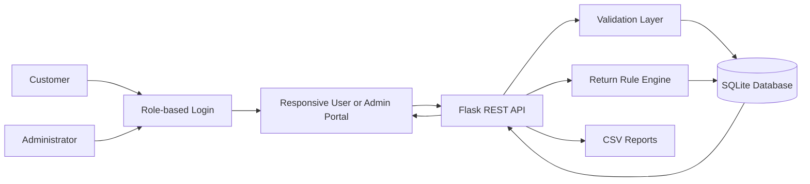
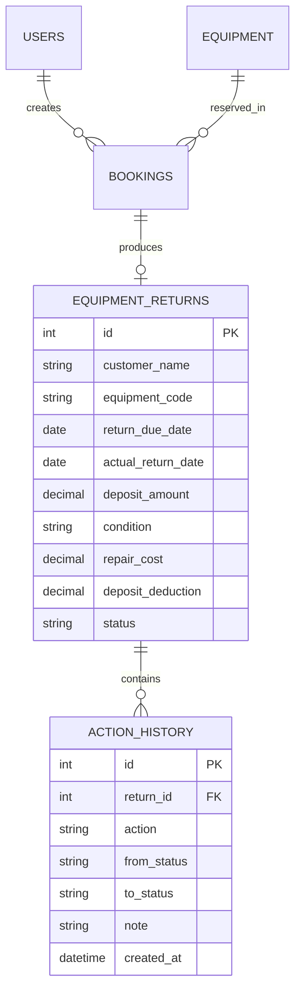

# Equipment Return & Damage Tracker - Project Report

## Abstract

The Equipment Return & Damage Tracker is a role-based web application for SD Digitals that centralizes booking, rental, return, and damage-claim operations. Customers browse and book equipment, request returns, track rentals, and manage their profile. Administrators manage inventory, customers, inspections, damage reports, security-deposit deductions, workflow statuses, and reports. Password hashing and server-side sessions protect each portal.

## Problem statement

Equipment-return information is often spread across calls, messages, and spreadsheets. This makes overdue follow-up, damage documentation, deposit settlement, and accountability slow and inconsistent. The proposed system provides a single searchable workflow with validation, timestamps, financial calculations, history, alerts, and reports.

## Objectives

1. Digitize equipment-return scheduling and inspection.
2. Identify due and overdue rental records quickly.
3. Record condition, damage evidence, repair cost, and deposit deduction consistently.
4. Preserve a timestamped action history for professional claim handling.
5. Provide dashboard metrics and exportable operational reports.

## Existing and proposed system

| Existing process | Proposed system |
|---|---|
| Calls, WhatsApp, and separate sheets | One structured web application |
| Manual overdue checking | Automatic overdue flags |
| Informal damage notes | Standard inspection and claim workflow |
| Manual deposit calculation | Capped rule-based deduction calculation |
| No ownership trail | Owner, status, timestamps, and action history |
| Reports assembled manually | Live metrics and CSV export |

## Actors and use cases

- Customer/creator: provides return and contact information.
- Rental admin/delivery team: schedules returns, inspects equipment, records damage, and resolves claims.
- Administrator: monitors dashboard metrics, history, and reports.

## Role-based modules

| User portal | Admin portal |
|---|---|
| Login and dashboard | Login and operations dashboard |
| Book equipment | Equipment management |
| Return equipment | Customer management |
| My rentals | Return requests and inspections |
| Profile | Damage reports and deposit deductions |
| | Status updates and reports |

## Architecture

## Database design

## Workflow rules

1. A new record begins in `due` status.
2. A non-closed record past its due date is displayed as overdue.
3. Excellent, good, or fair equipment with no repair cost is closed and the deposit is released.
4. Damaged equipment or any positive repair cost creates a `claim_pending` record.
5. Lost equipment creates a `claim_pending` record and deducts the full deposit.
6. Deposit deduction is the lower of repair cost and deposit amount; it can never exceed the held deposit.
7. Every create, inspection, and status change writes an action-history entry.

## Security and validation

- Passwords are stored with secure one-way hashing.
- HTTP-only, same-site sessions enforce authentication.
- Role checks prevent customers from accessing admin APIs.
- Required fields are checked on both frontend and backend.
- Dates must use ISO format and financial values must be non-negative.
- Conditions and statuses are restricted to known values.
- SQLite statements use parameter binding.
- User-generated values are HTML-escaped before rendering in dynamic UI.

## Testing

Automated tests cover health checks, valid creation, missing-field validation, detail/history retrieval, clean-return closure, damaged-return claim creation, deduction caps, dashboard counts, and CSV reports. Manual tests should additionally cover responsive layouts, keyboard navigation, empty states, search, filters, and browser network failures.

## Future scope

- Authentication and role-based access
- Image uploads for damage evidence
- WhatsApp/email reminders
- Customer approval of deductions
- PostgreSQL production database
- Invoice and payment integration
- Advanced analytics and AI-assisted damage summaries

## Conclusion

The prototype replaces scattered return tracking with a clear operational workflow. It protects high-value equipment, creates a professional damage-claim record, and gives SD Digitals a practical foundation that can be deployed and extended.
